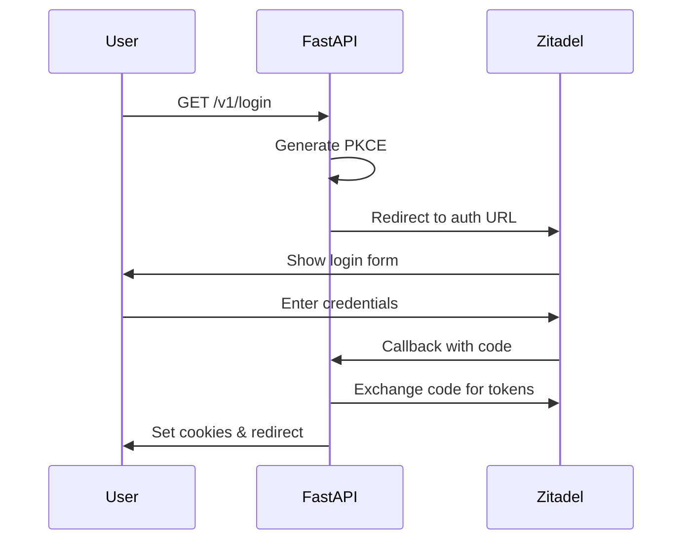
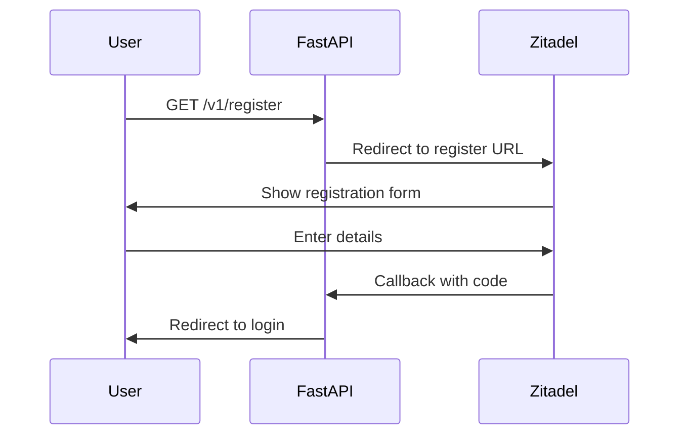

# FastAPI Zitadel Authentication Documentation

## Table of Contents
1. [Introduction](#introduction)
2. [Why Zitadel over Fief](#why-zitadel)
3. [Project Structure](#project-structure)
4. [Setup & Installation](#setup)
5. [Configuration](#configuration)
6. [Authentication Flow](#auth-flow)
7. [API Endpoints](#endpoints)
8. [Security Features](#security)
9. [Deployment Guide](#deployment)

## Introduction <a name="introduction"></a>

This project implements authentication in FastAPI using Zitadel as the identity provider. It provides secure user authentication, authorization, and session management with features like:

- OAuth 2.0 + OpenID Connect
- PKCE (Proof Key for Code Exchange)
- Role-based access control
- Session management
- Secure cookie handling

### Key Components Used:
- FastAPI
- Zitadel
- fastapi-zitadel-auth library
- Pydantic for configuration
- HTTPX for async HTTP requests

## Why Zitadel over Fief <a name="why-zitadel"></a>

The decision to use Zitadel instead of Fief was based on several factors:

1. **Enterprise Features**
   - Built-in organization management
   - More sophisticated role and permission system
   - Advanced audit logging

2. **Scalability**
   - Better handling of high-load scenarios
   - Built-in caching mechanisms
   - More robust infrastructure

3. **Security**
   - PKCE support out of the box
   - Better session management
   - More granular security controls

4. **Development Experience**
   - Better documentation
   - More active community
   - Official Python SDK support

## Project Structure <a name="project-structure"></a>

```
fastapi-zitadel-auth/
├── app/
│   ├── Auth/
│   │   ├── __init__.py
│   │   ├── dependency.py
│   │   └── router.py
│   ├── __init__.py
│   ├── Config.py
│   └── middleware.py
├── .env
├── main.py
└── requirements.txt
```

## Setup & Installation <a name="setup"></a>

1. Clone the repository:
```bash
git clone https://github.com/yourusername/fastapi-zitadel-auth.git
cd fastapi-zitadel-auth
```

2. Install dependencies:
```bash
pip install -r requirements.txt
```

3. Create `.env` file:
```env
APP_CLIENT_ID=your_app_client_id
PROJECT_ID=your_project_id
ZITADEL_HTTP_URL=https://your-instance.zitadel.cloud
CLIENT_ID=your_client_id
PRE_LOGIN_REDIRECT_URI=http://localhost:8000/v1/callback
POST_LOGIN_REDIRECT_URI=http://localhost:8000
SESSION_SECRET_KEY=your_secret_key
ZITADEL_AUTH_URL=https://your-instance.zitadel.cloud/oauth/v2/authorize
ZITADEL_USERINFO_URL=https://your-instance.zitadel.cloud/oidc/v1/userinfo
PORT=8000
```

## Configuration <a name="configuration"></a>

### Config.py
```python
from pydantic_settings import BaseSettings

class Setting(BaseSettings):
    APP_CLIENT_ID: str
    PROJECT_ID: str
    ZITADEL_HTTP_URL: str
    CLIENT_ID: str
    PRE_LOGIN_REDIRECT_URI: str
    SESSION_SECRET_KEY: str
    ZITADEL_AUTH_URL: str
    ZITADEL_USERINFO_URL: str
    POST_LOGIN_REDIRECT_URI: str
    PORT: int
    
    class Config:
        env_file = ".env"
        extra = "ignore"

Config = Setting()
```

## Authentication Flow <a name="auth-flow"></a>

1. **Login Flow**


2. **Registration Flow**


## API Endpoints <a name="endpoints"></a>

### Authentication Endpoints

1. **Login Endpoint**
```python
@Auth_Router.get("/login")
async def login_redirect(request: Request):
    code_verifier = pkce.generate_code_verifier(length=128)
    code_challenge = pkce.get_code_challenge(code_verifier)
    request.session["code_verifier"] = code_verifier
    
    zitadel_auth_url = (
        f"{Config.ZITADEL_AUTH_URL}"
        f"?client_id={Config.APP_CLIENT_ID}"
        f"&response_type=code"
        f"&scope=openid profile email"
        f"&redirect_uri={Config.PRE_LOGIN_REDIRECT_URI}"
        f"&code_challenge={code_challenge}"
        f"&code_challenge_method=S256"
    )
    return RedirectResponse(url=zitadel_auth_url)
```

2. **Callback Endpoint**
```python
@Auth_Router.get("/callback")
async def callback(request: Request):
    code = request.query_params.get("code")
    code_verifier = request.session.get("code_verifier")
    token_response = await _extract_access_token(request, code_verifier)
    
    response = RedirectResponse(url="/v1/current-user")
    response.set_cookie(
        key="access_token",
        value=token_response["access_token"],
        httponly=True,
        secure=True,
        samesite="lax"
    )
    return response
```

## Security Features <a name="security"></a>

1. **PKCE Implementation**
- Uses cryptographic proof keys
- Prevents authorization code interception attacks
- Implements S256 code challenge method

2. **Secure Session Management**
```python
app.add_middleware(
    SessionMiddleware,
    secret_key=Config.SESSION_SECRET_KEY,
    session_cookie="sessionid",
    max_age=3600,
    https_only=True,
    same_site="lax"
)
```

3. **Protected Routes**
```python
@Auth_Router.get(
    "/protected/admin",
    dependencies=[Security(Validate_is_admin_user)],
)
async def protected_for_admin(Request: Request):
    user = Request.state.user
    return {"message": "Welcome Admin", "user": user["preferred_username"]}
```

## Deployment Guide <a name="deployment"></a>

1. **Prerequisites**
- Python 3.8+
- FastAPI
- Zitadel account
- Domain for your application

2. **Zitadel Setup**
- Create a new project in Zitadel
- Configure OAuth application
- Set redirect URIs
- Note down client credentials

3. **Environment Configuration**
- Set up production environment variables
- Configure CORS properly
- Enable HTTPS
- Set secure cookie options

4. **Running the Application**
```bash
uvicorn main:app --host 0.0.0.0 --port $PORT
```

## Role of fastapi-zitadel-auth Library

The `fastapi-zitadel-auth` library provides:

1. **Easy Integration**
```python
zitadel_auth = ZitadelAuth(
    issuer_url=Config.ZITADEL_HTTP_URL,
    project_id=Config.PROJECT_ID,
    app_client_id=Config.APP_CLIENT_ID,
    allowed_scopes={
        "openid": "OpenID Connect",
        "email": "Email",
        "profile": "Profile",
        "urn:zitadel:iam:org:project:id:zitadel:aud": "Audience",
        "urn:zitadel:iam:org:projects:roles": "Roles",
    }
)
```

2. **Built-in User Management**
- User validation
- Role checking
- Token validation

3. **Security Features**
- PKCE support
- Token handling
- Session management

For more detailed information and updates, please visit the [GitHub repository](https://github.com/yourusername/fastapi-zitadel-auth).
